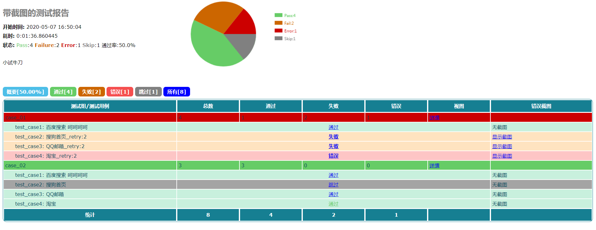
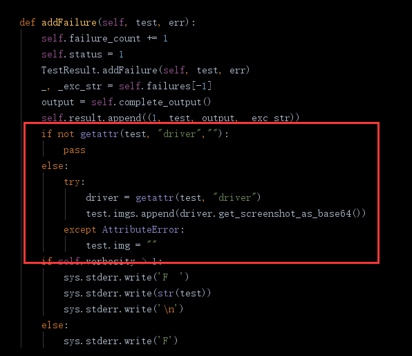
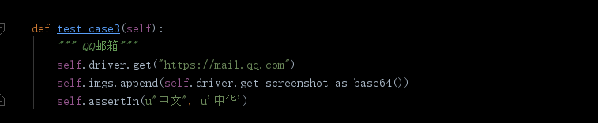
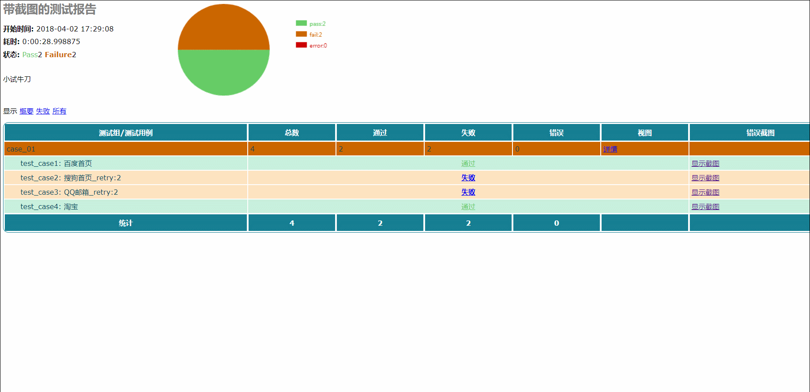
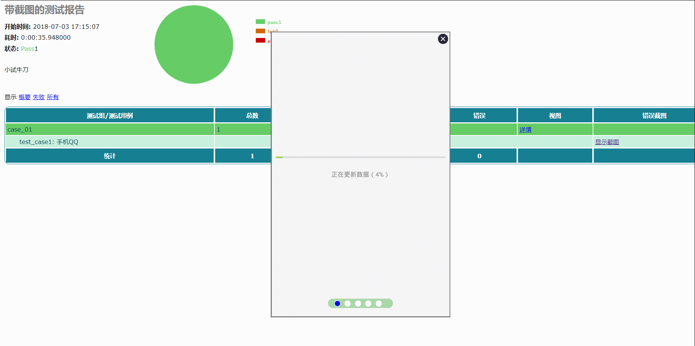
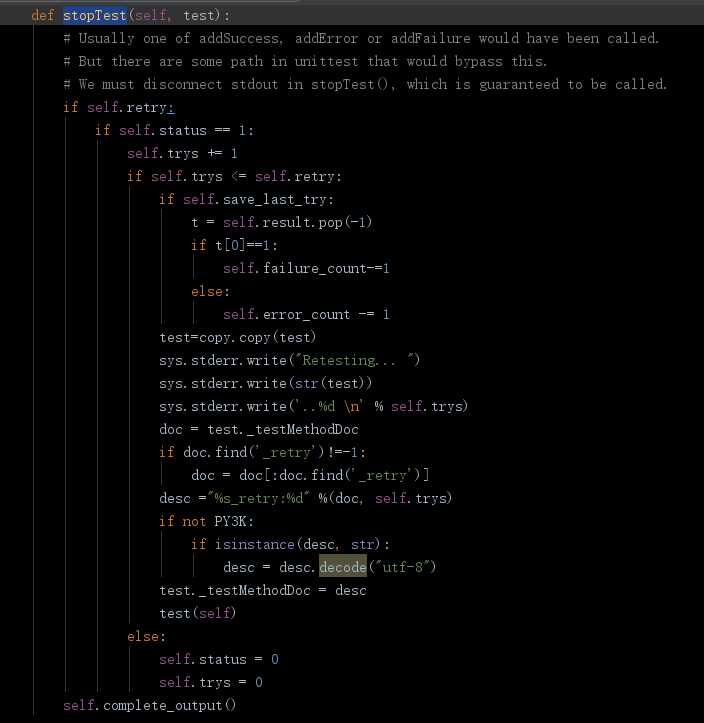
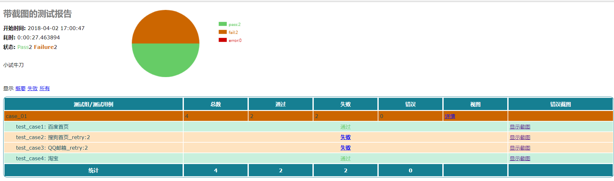
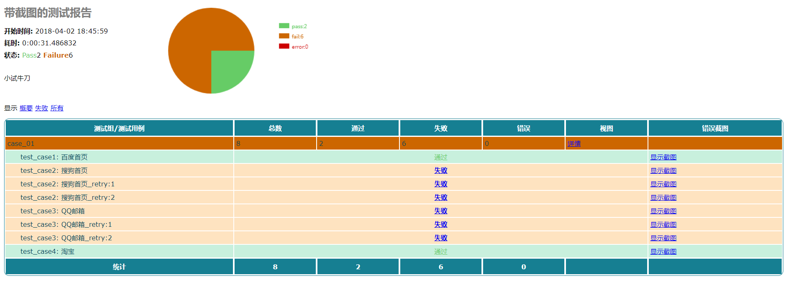
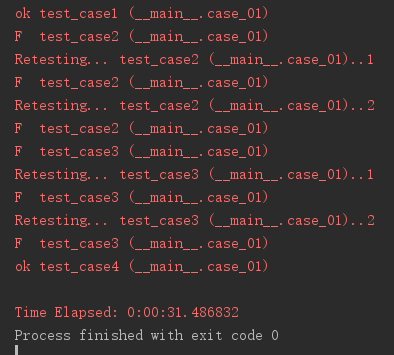

# HTMLTestRunner 汉化版
在原版的基础上进行扩展和改造
# 报告汉化，错误日志
 
# selenium/appium 截图
截图功能根据测试结果，当结果为fail或error时自动截图<br/>
截图方法在_TestResult 的测试结果收集中，报告使用的截图全部保存为base64编码，避免了报告图片附件的问题，可以根据自己使用的框架不同自行调整，selenium 使用的是get_screenshot_as_base64 方法获取页面截图的base64编码<br/>

因为要提取用例中的driver变量获取webdriver对象，所以要实现截图功能必须定义在用例中定义webdriver 为driver
```python
    def setUp(self):
        self.imgs=[]  # （可选）初始化截图列表
        self.driver = webdriver.Chrome()
```
或者
```python
    @classmethod
    def setUpClass(cls):
        cls.driver = webdriver.Chrome()
```
也可以在测试过程中某一步骤自定义添加截图,比如<br/>
<br/>
生成报告后会统一进行展示<br/>
**Selenium截图轮播效果**<br/>
<br/>
**Appium效果轮播截图**<br/>

# 用例失败重试
根据unittest的运行机制，在stopTest 中判断测试结果，如果失败或出错status为1，判断是否需要重试；<br/>


在实例化HTMLTestRunner 对象时追加参数，retry，指定重试次数，如果save_last_try 为True ，一个用例仅显示最后一次测试的结果。
```python
HTMLTestRunner(title="带截图的测试报告", description="小试牛刀", stream=open("sample_test_report.html", "wb"), verbosity=2, retry=2, save_last_try=True)
```


如果save_last_try 为False，则显示所有重试的结果。
```python
HTMLTestRunner(title="带截图的测试报告", description="小试牛刀", stream=open("sample_test_report.html", "wb"), verbosity=2, retry=2, save_last_try=False)
```


运行中输出效果如下：<br/>


`注意：在python3 中因为unittest运行机制变动，在使用setUp/tearDown中初始化/退出driver时，会出现用例执行失败没有截图的问题，所以推荐使用样例中setUpClass/tearDownClass的用法`

# changelog

+ 20170925
    - 测试报告完全汉化，包括错误日志的中文处理
    - 针对selenium UI测试增加失败自动截图功能，截图自动轮播
    - 增加失败自动重试功能
    - 增加饼图统计
    - 同时兼容python2.x 和3.x
+ 20180402
    - 表格样式优化
    - 修复部分bug
    - 增加截图组，可展示多张截图，首次打开自动播放
    - 增加仅展示最后一次运行结果，多次重试时，每个测试用例仅展示一次
+ 20181213
    - 增加分类标签、通过率等，优化样式
    - 修复部分框架在SetUP中失败导致测试中断的问题导致 ErrorHandle的问题
    - 修复部分编码Bug
    - 优化运行逻辑
    - 对js代码优化，修复部分多次运行run导致结果异常的bug