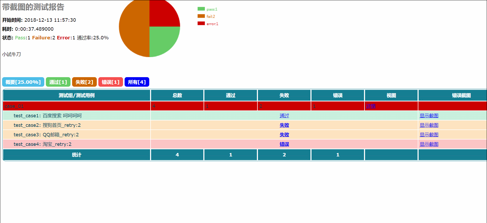
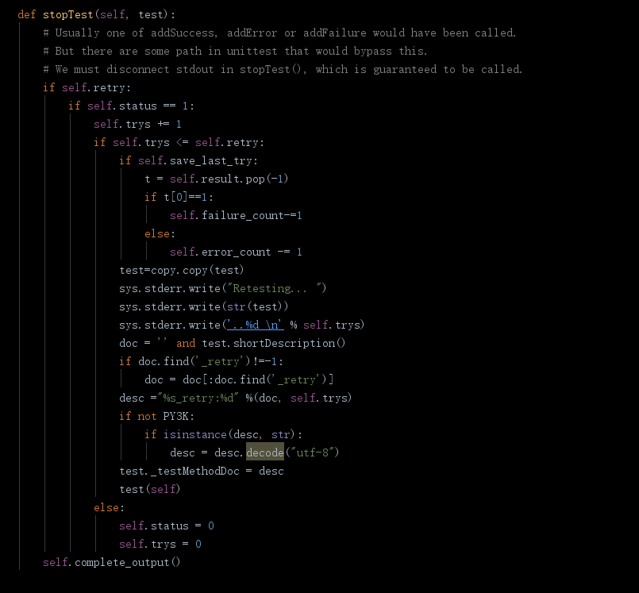
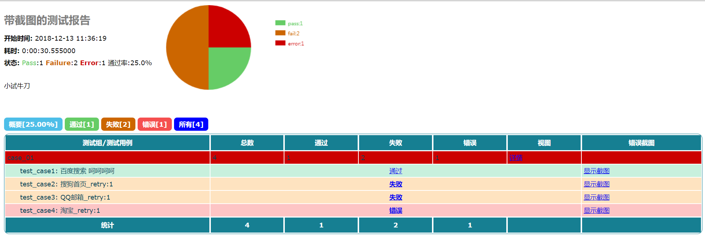
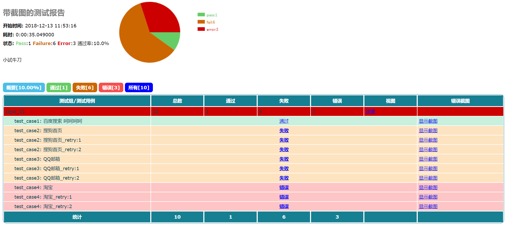

# HTMLTestRunner 汉化版

+ 20170925
    - 测试报告完全汉化，包括错误日志的中文处理
    - 针对selenium UI测试增加失败自动截图功能
    - 增加失败自动重试功能
    - 增加饼图统计
    - 同时兼容python2.x 和3.x
+ 20180402
    - 表格样式优化
    - 修复部分bug
    - 增加截图组，可展示多张截图，首次打开自动播放
    - 增加仅展示最后一次运行结果，多次重试时，每个测试用例仅展示一次

# 报告汉化
 
# selenium 截图
截图功能根据测试结果，当结果为fail或error时自动截图
截图方法在_TestResult 的测试结果收集中，可以根据自己使用的框架不同自行调整，selenium 使用的是get_screenshot_as_base64 获取页面截图的base64编码，避免了图片文件的问题


因此要提取用例中的driver变量获取webdriver对象，所以要实现截图功能必须定义在用例中定义webdriver 为driver
```python
def setUp(self):
    self.imgs=[]  # （可选）初始化截图列表
    self.driver = webdriver.Chrome()
```
也可以在测试过程中某一步骤自定义添加截图,比如

生成报告后会统一进行展示
**截图播放效果**


# 用例失败重试
根据unittest的运行机制，在stopTest 中判断测试结果，如果失败或出错status为1，判断是否需要重试；


在实例化HTMLTestRunner 对象时追加参数，retry，指定重试次数，如果save_last_try 为True ，一个用例仅显示最后一次测试的结果。
```python
HTMLTestRunner(title="带截图的测试报告", description="小试牛刀", stream=open("sample_test_report.html", "wb"), verbosity=2, retry=2, save_last_try=True)
```

如果save_last_try 为False，则显示所有重试的结果。
```python
HTMLTestRunner(title="带截图的测试报告", description="小试牛刀", stream=open("sample_test_report.html", "wb"), verbosity=2, retry=2, save_last_try=False)
```

运行中输出效果如下：
